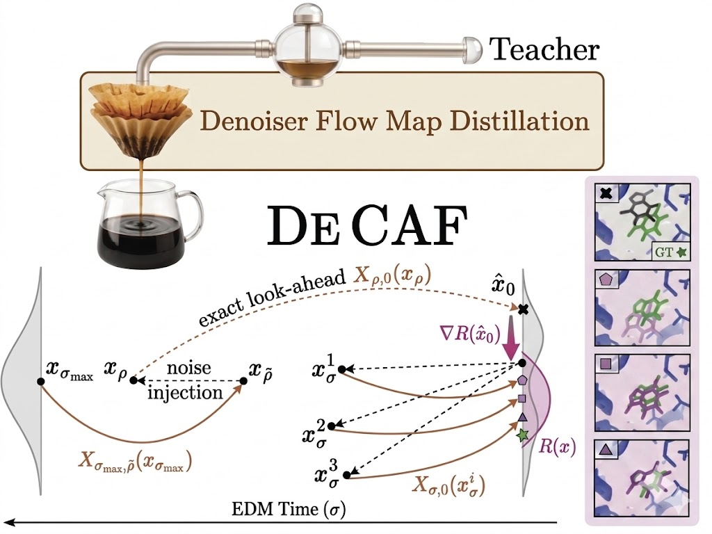
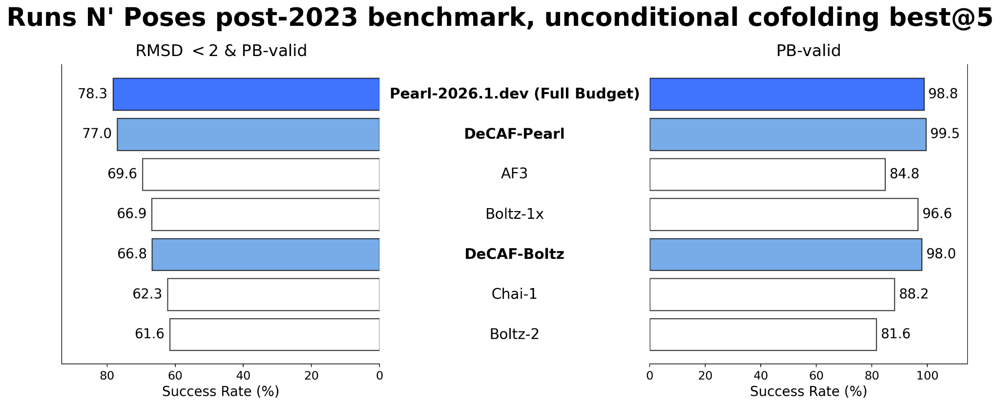

# DeCAF: Denoiser Cofolding All-atom Flowmap Model

**Distilling Pearl: Flow Maps for Fast All-Atom Cofolding**

[[arXiv]](https://arxiv.org/abs/2606.08375)
[[Blog Post]](https://www.genesis.ml/news/genesis-model-distillation)

<p align="center">
  
</p>

> **Work in progress** — code release coming soon.

## Overview

DeCAF is the first flow map model for all-atom cofolding. Instead of taking many steps along the denoising trajectory, a flow map learns to jump directly from one point on the trajectory to another, potentially traversing the entire generation process in just a handful of steps.

DeCAF-Pearl distills the [Pearl](https://arxiv.org/abs/2510.24670) cofolding foundation model into a fast few-step generator, achieving a **5x inference speedup** with near-parity in structure prediction quality. Using over 5x fewer compute steps, DeCAF-Pearl exceeds AlphaFold 3, Chai-1, Boltz-1x, and Boltz-2 on the Runs N' Poses benchmark success rate by 3 to 15 percentage points.

<p align="center">
  
</p>

<p align="center"><em>Runs N' Poses (post-2023) success rate, best@5: DeCAF-Pearl nearly matches its full-budget teacher while outperforming AF3, Boltz-1x, Chai-1, and Boltz-2.</em></p>

### Key design decisions

1. **Reparameterizing to noise-level space.** The default move when adapting flow map methods to a new domain is to keep the time variable from the teacher. We reparameterize the entire flow map to live in sigma (noise-level) space directly, so the problematic chain-rule factor never appears.

2. **Committing to clean-structure prediction.** Rather than matching velocities, DeCAF predicts the clean structure directly given a noisy input and two noise levels. This lets us reuse the rigid-alignment loss exactly as the teacher does, substantially reducing gradient variance.

3. **DeCAF-Search: a single algorithm for every compute budget.** We built DeCAF-Search as a unified algorithm that subsumes Feynman-Kac steering, diffusion-MCTS, and inference-time scaling as special cases of a single framework: maintain a population of particles, look ahead with the flow map, refine in clean-structure space, re-noise, and reallocate compute according to a selection rule.

### Why it matters

- **High-throughput virtual screening.** Cofold 5x more molecules against a target at the same compute budget.
- **Scalable synthetic data generation.** Generate 5x more high-quality protein-ligand complexes to train better downstream models, without losing the structural signal they depend on.

## Model checkpoint

The DeCAF-Pearl checkpoint is available on [Google Drive](https://drive.google.com/drive/folders/1QFunXYqvor_LWF61wVnb4ZuD_3MGXUEm).

Download it, then run the bundled end-to-end example:

```bash
# place the downloaded checkpoint at /tmp/decaf_ckpt.ckpt (or pass a path)
bash scripts/run_decaf_example.sh /path/to/decaf_ckpt.ckpt
```

This runs few-step DeCAF inference on `examples/prot_custom_msa.yaml` and writes a predicted structure CIF. See [docs/decaf_prediction.md](docs/decaf_prediction.md) for full prediction and evaluation instructions.

## Citation

```bibtex
@misc{scarpellini2026fewstepcofoldingallatomflow,
      title={Few-step Cofolding with All-Atom Flow Maps}, 
      author={Gianluca Scarpellini and Ron Shprints and Peter Holderrieth and Juno Nam and Pranav Murugan and Rafael Gómez-Bombarelli and Tommi Jaakola and Maruan Al-Shedivat and Nicholas Matthew Boffi and Avishek Joey Bose},
      year={2026},
      eprint={2606.08375},
      archivePrefix={arXiv},
      primaryClass={cs.LG},
      url={https://arxiv.org/abs/2606.08375}, 
}
```

## Acknowledgments

The research team at Genesis is grateful to our collaborators from Massachusetts Institute of Technology: Ron Shprints, Peter Holderrieth, Juno Nam, Rafael Gomez-Bombarelli and Tommi Jaakola; Carnegie Mellon University: Nicholas Matthew Boffi, and Joey Bose from Imperial College London and Mila.

## License

See [LICENSE](LICENSE) for details.
